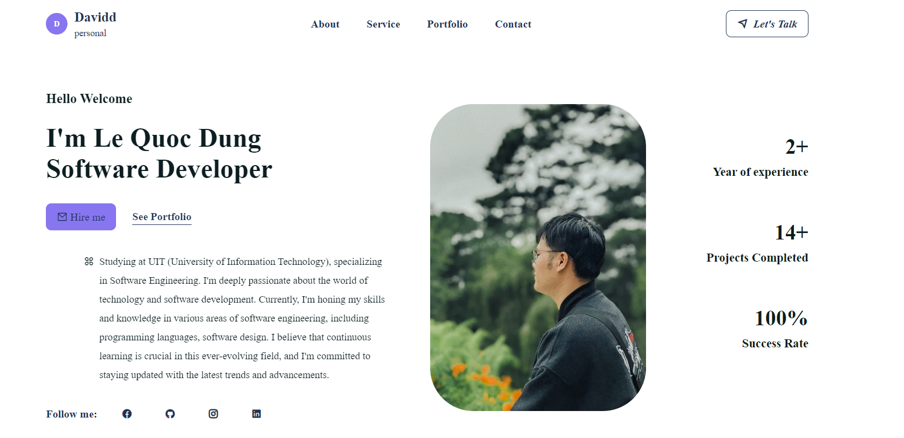
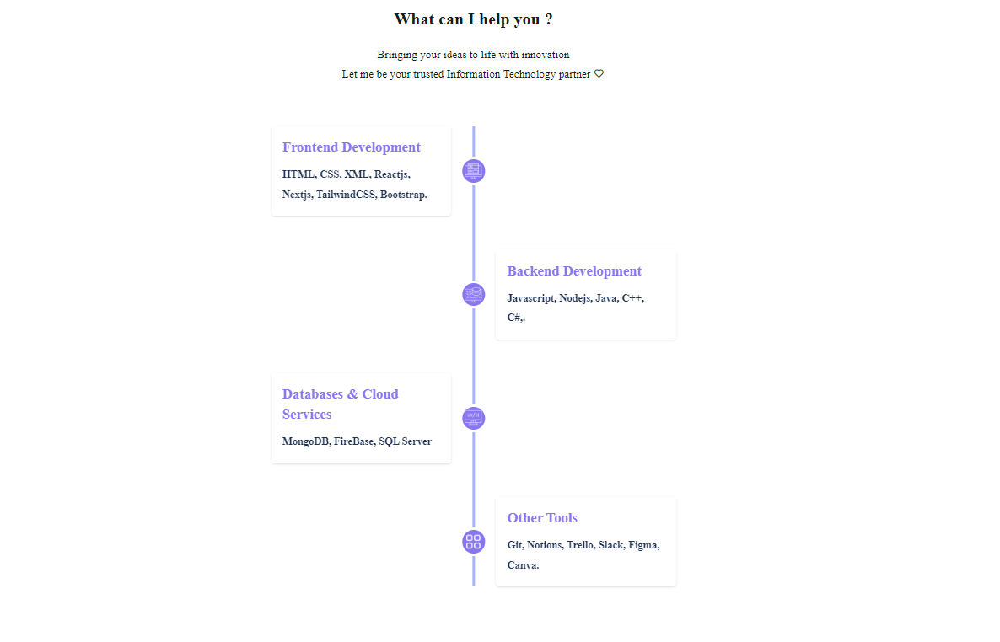
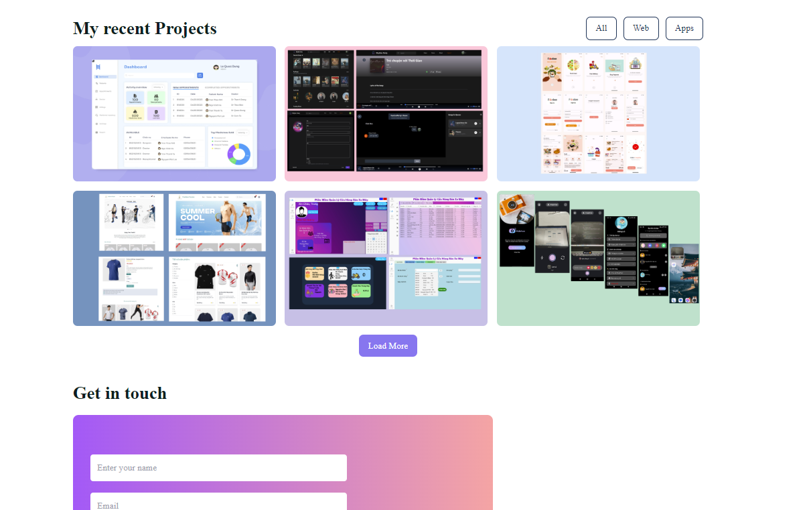

# Personal Portfolio

This was a website built to showcase my technical skills, web design skills.

## Requirement

- Runtime environment:
    - Node.js 20.10.0+.
    - GithubPage for hosting.

- Development environment:
    - Node.js 20.10.0+.
    - React.js 18.2.0+ for frontend development.
    - Tailwind CSS for styling.

## Installation Guide

To install and run the project locally, follow these steps:

1. Clone this repo.
2. Run `npm install` to install the dependencies.
3. Run `npm start` to start the server.

## User Guide

You can simply click this [link](https://dungle2983.github.io/MyPortfolio/) to get started.

## User Interface

## Authors

[Lê Quốc Dũng](https://github.com/DungLe2983)
